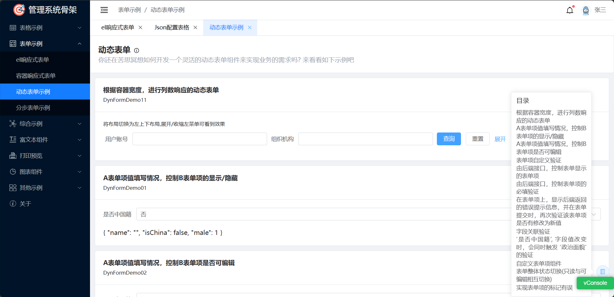
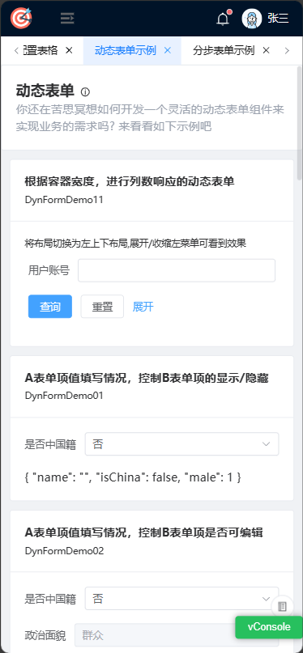

# 管理系统骨架项目

## 简介

* 基于vue3 + ts + vite + Element Plus + Tailwindcss, 紧跟最新技术栈
* 同时兼容PC端和移动端
* 前端骨架项目, 包含MIS系统开发常用组件, 以及常见界面开发示例

## 资料/文档

[管理系统骨架项目文档](https://free_pan.gitee.io/archetype-backend-template-doc/)

[管理系统骨架项目视频](https://www.bilibili.com/video/BV1v64y1V7to)

## 预览

### 在线预览

[管理系统骨架项目预览](https://free_pan.gitee.io/archetype-backend-template)

### PC端



### 移动端



## 运行/打包

#### pnpm 用户

```shell
# 安装依赖
pnpm install

# 本地运行
pnpm run dev

# 本地打包
pnpm run build
```

#### npm 用户

```shell
# 安装依赖
npm i --legacy-peer-deps

# 本地运行
npm run dev

# 本地打包
npm run build
```

## 交流/学习

扫码加我, 请备注: 骨架项目交流


**项目地址**


**文档地址**


**视频地址**


